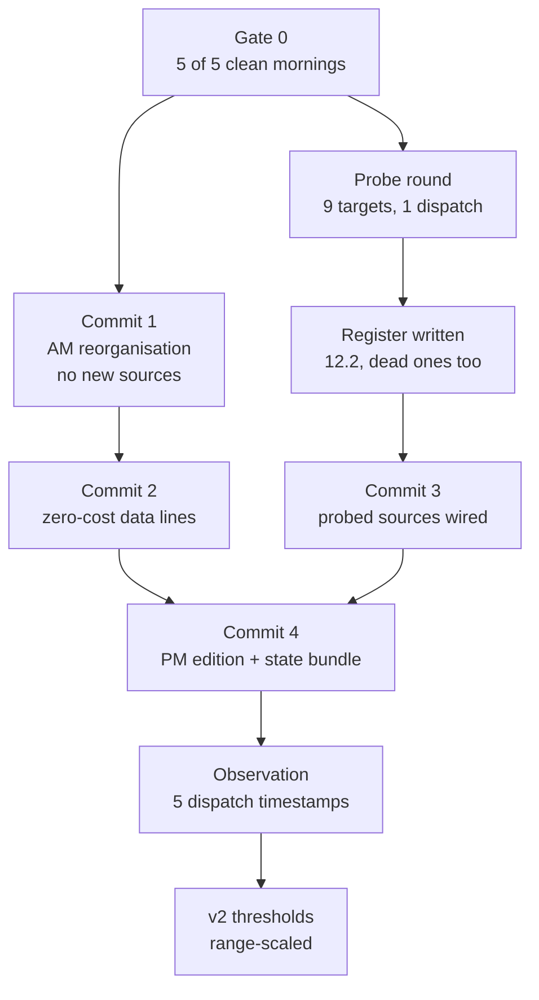

# Daily Market Brief — Handoff to Claude Code

2026-09-17 · @Someone

---

> ### ⚠ READ THIS FIRST — added on commit, 2026-09-18. Not part of the plan.
>
> The plan below is **verbatim and unedited.** It was written on 2026-09-17
> against `PROJECT_STATE.md` **rev 17**. The repository is at **rev 21**. Four
> things it says are now out of date, and one thing it asks for is already
> built:
>
> 1. **Gate 0 is CLEARED.** The plan says *"At rev 17 the project stood at 3 of
>    5 clean mornings."* The fifth landed 2026-09-18. Delivery is solved —
>    `PROJECT_STATE.md` §2.1h. **Everything in §9 is unblocked.**
> 2. **Fix 2 of the three in §5 is already in the shipped code.** The plan asks
>    to *"make a non-200 throw"* in the Apps Script because `muteHttpExceptions`
>    silences failures. `trigger/apps-script.gs` has thrown on `code !== 204`
>    since v5, with a comment saying why. **Do not rebuild it.** Fixes 1 (the
>    latency banner) and 3 (renew the token) stand and are both real.
> 3. **A bug was found the morning after this plan was written.** FED PATH —
>    which §3 of the plan renames to EXPECTATIONS — prints a target range that
>    is stale for 1–2 days after every FOMC (`PROJECT_STATE.md` §3.24). The
>    rename does not fix it. **Fix it inside Commit 1**, which rewrites that
>    section anyway and needs no new source to do it.
> 4. **The fragile fortnight has a fourth entry the plan does not know about.**
>    A scheduled task outside this repository, able to send mail, stops being
>    dormant on **26 October** — inside the plan's own 25 Oct – 7 Nov window
>    (`PROJECT_STATE.md` §3.25).
> 5. **The dispatch-second observation is at five samples, not three.**
>    08:20:13Z on all five days, which strengthens the §5 argument rather than
>    weakening it.
>
> Reconciliation, decisions logged, and the revised build order:
> `PROJECT_STATE.md` §13.

## 1 · What this document is

A build plan, produced in one planning chat on 17 September 2026 against `PROJECT_STATE.md` rev 17 and `SYNOPSIS.md`. **Nothing in it has been built, probed or committed.** No repository file was touched and `PROJECT_STATE.md` was not updated — that update is part of the build, and §10 lists what it must contain.

Every claim here is marked decided, guessed, or needing a probe. Nothing marked 🔴 enters code until a probe from an Actions runner answers it and its payload shape is read. That is §12.3 of `PROJECT_STATE.md`, unchanged.

**The gate.** At rev 17 the project stood at 3 of 5 clean mornings. Plan §6 puts all new building after the fifth. §9 of this document respects that gate. If the count has broken and restarted since, the gate moves with it.

If you are executing, read §9 first — it is the build order and it explains what blocks what. The rest is the reasoning behind it.

## 2 · Where it started, and the pivot

The second edition was designed to report data actuals — FRED wired to say *"came in at X"*, landing 14:00 Lisbon, thirty minutes after the 08:30 ET prints. Three probe rounds settled its method. It was never built.

**Kabil killed that job in the first message of this chat.** He is already at the desk when data prints; a brief that reports the number after it lands tells him what is already on his screens. The edition was built without stopping to ask what it was for.

**The two jobs he actually wants from the system:**

1. See what changed, what broke, and what is coming — near term through twelve months out.
2. Be reminded every morning of things that matter and are easy to forget, so he is never caught unprepared.

**What the second edition becomes:** a daily pre-NY-open scan — breaking news, announcements, policy actions, geopolitics, sentiment, expectations. Every day, not only data days. The data calendar changes what is *in* it, never whether it sends.

**Three standing constraints from Kabil, all honoured below:** he follows the NY and Asia sessions; he works in UTC, Lisbon, New York and Tokyo time; and he tracks Trump, Bessent, Warsh and Rubio through their **actions, scheduled announcements and dated plans — not their remarks**.

**The FRED work is not wasted.** It is repurposed from release-minute actuals to the economic backdrop — unemployment trend, yield curve, CPI trend — which is the "economic situation" leg of the first job.

## 3 · The AM brief — three tiers

**The diagnosis: the AM brief does not lack sections, it lacks hierarchy.** Eleven sections typeset with equal authority is the condition that let a $6bn buyback read as broken data. Adding sections to a flat list makes that worse. The redesign is three tiers, where the first answers most mornings alone.

**Tier 1 — the first screen, about 15 lines.**

| Block | Carries | Cost |
| --- | --- | --- |
| CLOCKS | UTC · LIS · NY · TYO, plus session state — Asia closed Xh ago, Europe open Xh, NY opens in Xh | derived, no fetch |
| OVERNIGHT | What changed since yesterday's PM: BTC/ETH, Asia close, top headline | state + existing |
| TODAY | Data windows, policy events landing today, risk windows still ahead — **merges CALENDAR + RISK WINDOWS** | existing |
| CYCLE | Recurring structure firing within its `lead` window (see §6) | derived, no fetch |

**Tier 2 — the standing picture.** CRYPTO · FLOWS · DERIVATIVES · SENTIMENT · MACRO & EQUITIES. All existing sections, carrying the new lines in §7.

**Tier 3 — the horizons.**

- **AHEAD** — rebucketed to 365 days, five buckets (§6)
- **POLICY DESK** — Warsh, Trump actions, buybacks, auctions
- **EXPECTATIONS** *(was FED PATH)* — Kalshi Fed odds, plus midterm control contracts; geopolitical odds if Polymarket probes clean
- **BACKDROP** — FRED repurposed: unemployment trend, yield curve, CPI trend
- **NEWS** — CNBC as wire, ZeroHedge as marked commentary (D16)

**Asia is a render change, not a new source.** Yahoo already reaches Nikkei, Hang Seng, USDJPY and CNH. The 09:20 Lisbon brief lands 17:20 Tokyo — Asia is closed and it is perfectly placed to recap it.

**The section count goes 11 → 14** (two merges offset three additions). Plan §9 says the section count is not the metric and the arrival time is. **The tier structure is the defence: if Tier 1 does not work as a standalone first screen, this redesign has failed regardless of Tiers 2 and 3.**

## 4 · The PM edition — spine plus delta body

**Identity:** `PM DELTA — pre-NY open`. A subject prefix distinct from the AM brief, so the inbox tells them apart unopened. The ` Market Brief -  ` prefix on the AM edition is load-bearing for the chat-side Mode Check and must not change.

**The structural call: the PM is a delta, not a second full brief.** A delta stays short permanently and cannot duplicate the AM. A standalone scan duplicates it and grows with every source added — that is the path to an email he stops opening.

**Spine — always prints, capped at about six lines:**

- BTC / ETH, level and change **since the 09:20 brief** (not since yesterday)
- Asia close: Nikkei, Hang Seng, USDJPY
- Europe now, plus S&P and Nasdaq futures
- DXY, 10Y
- Next dated event, with countdown
- Today's US data window — the 08:30 ET list, or `none scheduled`

**Body — prints only when something is in it:** new wire headlines since 09:20 · new policy actions or dated announcements · expectations shift (Fed-path odds moved) · empty → `No material change since 09:20`.

The spine gives a real overview on quiet days; the body keeps it short on loud ones. The spine is capped by design and the body only exists when there is something in it, so the edition cannot grow into a second brief.

**Thresholds v1 — one config block, not scattered through fetchers:**

| Line | Fires at | Reason |
| --- | --- | --- |
| BTC / ETH | ±1.0% since 09:20 | \~4.5h window; outside normal drift in a typical regime |
| DXY | ±0.3% | rarely moves this much intraday without a macro cause |
| 10Y | ±5bp | where rates desks reprice, not noise |
| Fed-path odds | ±5 points | below this is book noise on a thin prediction market |
| BTC.D | ±0.3pp |  |
| Stablecoin supply | ±0.5% |  |
| Brent | ±1.5% |  |
| Brent − WTI spread | ±$0.50 |  |
| IBIT | suppressed pre-market unless volume present |  |
| Wire | any new item since 09:20 | no threshold — Kabil judges relevance |

**⚠ Fixed percentages are regime-blind, and that is a known v1 compromise.** ±1.0% on BTC is a shrug at 60 vol and an event at 25 vol. The systematically correct version scales to recent realised range — *"moved more than 40% of average daily range"*. That needs trailing daily candles (probe target 3), so fixed ships now and gets replaced by evidence, not argument.

**The shadow log makes that replacement possible, and must ship in the same commit.** Every PM run records what the body *would* have printed at every threshold level, even when suppressed. After about two weeks the v2 thresholds are measured. Retrofitting it throws away the most valuable data the edition will ever produce.

**Missing AM baseline — an explicit rule, not an edge case.** The PM reads today's AM state key. If it is absent, **deltas are suppressed entirely**: the spine prints absolute levels only and names why. It never falls back to yesterday's close — that is exactly the bug that made Sunday's brief print a two-day move labelled as one day. A missing AM is already a red-banner condition under D15, so the PM inherits an existing detector rather than inventing one.

**The PM writes its own state key** and needs **its own duplicate-send guard** — the guard proven in §2.1c covers the AM only.

## 5 · Timing, triggers and health

**Apps Script day timers do not fire at a set minute.** A timer set to "8am" fires anywhere in that hour. The AM trigger is the proof: set to the 9–10am slot, it dispatches at 08:20:13 UTC — the same second on all three measured days. Google draws an offset once and keeps it.

**Consequence: a plain `atHour(8)` ET anchor has a worst case of 08:59 ET — after the 08:30 print.**

| Setting | Fires (ET) | Lisbon | Beats the 08:30 print? |
| --- | --- | --- | --- |
| atHour(7) | 07:00–07:59 | 12:00–13:00 | always, but early |
| atHour(8) | 08:00–08:59 | 13:00–14:00 | coin flip |
| **atHour(8).nearMinute(0)** | **07:45–08:15** | **12:45–13:15** | always, ≥15 min spare |

**Decision: `atHour(8).nearMinute(0)`, with `atHour(7)` as the documented fallback.** This is the latest possible scan that still clears the print — which is what Kabil asked for, made safe by a narrower window rather than by gambling.

**⚠ `nearMinute` is documentation, not evidence.** Nobody has watched this trigger fire, and under §12.3 that counts for nothing. It also **cannot be probed** — it is Google's scheduler behaviour, not something a runner can call. The only test is to install it and watch **five dispatch timestamps**. Record that in §2 as an *observation*, explicitly not a probe. If the spread wanders past 08:15 ET, drop to hour 7. If the drawn offset lands late, delete and recreate the trigger — a fresh draw costs nothing.

**Anchor the cron to New York, not Lisbon.** Two Apps Script timers (12:00 and 11:00 Lisbon) and the script dispatches only if the current New York hour is 8. This is the D5 two-slot pattern already proven for the AM brief — one project, one script, one version to keep in sync. A second Apps Script project with a NY timezone would be cleaner in theory and is **not recommended**: two copies to keep in sync is exactly what cost two weekend briefs.

**The fragile fortnight:**

| Date | Event | Effect |
| --- | --- | --- |
| 25 Oct 2026 | Portugal falls back | Lisbon–NY gap 5h → 4h; a Lisbon-anchored trigger lands an hour wrong |
| 1 Nov 2026 | US falls back | gap returns to 5h, desync closes |
| 3 Nov 2026 | **US midterms** | highest-volatility political event of the year |
| 7 Nov 2026 | **Trigger token expires** | dispatch dies |

**⚠ The token expiry is dangerous because no existing detector catches it.** Walk the chain: token dies → dispatch fails → no brief at 09:20 → the old GitHub cron wakes hours later → the brief **does** arrive, just four hours late → `last_sent_date` is written → **the gap detector stays silent**, because no day was missed. The version detector will not fire either; the script version is fine, only the token is dead. The system would silently return to the 4.5-hour delay that took three weeks to solve, reporting itself healthy throughout.

**Three fixes, all required:**

1. **Add a delivery-latency check to `health.py`** — the brief compares its own build time to target and banners when more than 30 minutes late. This closes the token hole and catches any future timing degradation.
2. **Check `muteHttpExceptions` in the Apps Script.** With it set, a 401 from GitHub returns as an ordinary response and **does not throw**, so Google sends no alert and the failure is completely silent. Make a non-200 throw.
3. **Renew the token in late October** — before the clock change and before the midterms, so the fragile fortnight contains no scheduled maintenance at all. Add the next countdown to `data/watchlist.txt` the same day.

**Sequencing note:** the PM timer lives in the same Apps Script project as the AM trigger, so adding it means editing the script that currently dispatches the 09:20 brief. The five-dispatch observation cannot start until that edit lands, and that edit sits behind the gate.

## 6 · The calendar layer

### AHEAD, and the `lead` field

**AHEAD goes to 365 days, five buckets:** `NOW (7d)` · `THIS MONTH` · `3 MONTHS` · `6 MONTHS` · `12 MONTHS`. This closes the §5 open question about whether the 130-day horizon was right.

**A 365-day horizon cannot print everything for 365 days** — it floods and becomes unreadable, which is the flat-list failure again. **The fix is one new watchlist field: `lead`** — how many days ahead an entry starts appearing. Impact sets lead time:

| Entry | `lead` |
| --- | --- |
| Lunar New Year | 45 |
| Golden Week | 30 |
| FOMC | 21 |
| Deribit quarterly expiry | 14 |
| OPEC+ ministerial | 14 |
| Triple witching | 10 |
| Thanksgiving / half-day | 7 |
| Monthly opex · Deribit monthly | 5 |
| VIX expiry · CME crypto roll · Columbus Day | 3 |

The 12-month bucket then holds only what deserves a year's notice.

### Per-class confirmation horizons — an amendment to D11

D11 is Locked and prints `unconfirmed` after 75 days. That exists because policy dates *decay* — summits move, court dates slip. **Holidays do not decay that way**, so a holiday entry would flag `unconfirmed` within 75 days of every refresh and the flag would become wallpaper. **A flag that always fires is a flag nobody reads.**

| `class` | Horizon | Applies to |
| --- | --- | --- |
| `policy` | 75 days *(unchanged)* | summits, OPEC, FOMC, announcements |
| `statutory` | 365 days | midterms and anything fixed in law |
| `holiday` | 365 days | US and China closures |
| `unlock` | 30 days | *reserved — unlocks dropped, see §11* |

This is a parameter on the existing mechanism, not a second mechanism. **It is still a change to a Locked decision** and must be logged as an amendment with the old value kept as `was:` — not quietly edited.

### Holidays — US and China are different problems

**US market holidays are rule-derivable** — statutory and fixed. Two exceptions break pure date math: **Good Friday moves with Easter**, and **ad-hoc closures happen** (NYSE shut for a national day of mourning in Jan 2025). So: derive by rule, override by watchlist.

**China's closure block is genuinely curated.** The festivals are lunar, but the actual shut-days — including makeup working weekends — are **announced annually by the State Council, usually in November for the following year**. Real curated data with a real annual refresh date.

**Document why they are handled differently**, or someone later "fixes" the inconsistency and breaks it.

**Tag each holiday with what it actually shuts** — US equities, US bonds, China/HK equities. Columbus Day shuts bonds while stocks trade; that is a different liquidity picture from Thanksgiving.

**Two live sections change behaviour on holidays:**

- **FLOWS prints zero on a US market holiday** — no creations or redemptions. Under D4 that is a **true zero, not `unavailable`**, and the brief must distinguish them or a real closure reads as a broken feed. **IBIT reuses this same rule.**
- **Asia holidays drain the session Kabil trades.** Golden Week and Lunar New Year mean thin books and gappy price for days — a position-sizing input, not trivia.

**Add "refresh China holiday table" to the watchlist as a dated entry, early November.** The file reminds you to maintain the file — the same trick as the token countdown.

### CYCLE — six recurring expiries, all pure date math

| Cycle | Rule | `lead` |
| --- | --- | --- |
| Monthly opex | 3rd Friday | 5 |
| Triple witching | 3rd Friday, Mar/Jun/Sep/Dec | 10 |
| VIX expiry | Wednesday \~30 days before the *following* month's 3rd Friday | 3 |
| Deribit monthly | last Friday, 08:00 UTC | 5 |
| Deribit quarterly | last Friday, Mar/Jun/Sep/Dec | 14 |
| CME crypto roll | last Friday | 3 |

**Holiday-shift rule:** if the third Friday is a market holiday (Good Friday can land there), expiry moves to Thursday. Reuse the US holiday table.

**⚠ The 08:00 UTC Deribit settlement matters more than the date.** The AM brief dispatches at 08:20 UTC — **twenty minutes after expiry**. On the last Friday of every month the expiring series has already settled and rolled off before the brief builds. Max pain and OI jump to the next expiry with no explanation. **The brief must name which expiry it is quoting**, and print a *"front expiry rolled today"* note on last-Friday mornings.

**Naming:** use *triple witching* consistently (it was quad until single-stock futures were delisted). Two names for one event reads as two events six months later.

### Watchlist entries supplied in this chat

| Event | Date | `class` | `lead` | Confirmation route |
| --- | --- | --- | --- | --- |
| Trump–Xi, AI | 24 Sep 2026 | policy | 30 | White House feed if probe 1 passes, wire otherwise · `CONFIRM` |
| OpenAI court answer | 1 Oct 2026 | policy | 30 | CourtListener if probe 8 passes, wire otherwise · `CONFIRM` |
| US midterms | 3 Nov 2026 | statutory | 60 | none needed — fixed in law |
| OPEC+ ministerials | \~8 per year | policy | 14 | hand-entered, full schedule in one sitting |

**The midterms date is derivable, not curated.** Federal law fixes it as the first Tuesday after the first Monday in November; November 2026 opens on a Sunday, so election day is **Tuesday 3 November 2026**. It cannot move — hence `statutory`.

**Enter it as a window, not a point.** Results arrive overnight NY and close races can take days. A single date means the countdown hits zero and the event disappears while it is still live.

**The other two are unverified.** Both post-date what could be checked in this chat. They enter with `CONFIRM` on them, as the 4 Nov refunding date already does.

**Midterms make Kalshi pay for itself.** It is already LIVE and keyless for Fed decisions; the same API carries House and Senate control contracts. EXPECTATIONS gains midterm odds at **zero new cost, no probe, no new host** — the strongest argument for that section existing at all.

**Add a weekly watchlist review as a recurring Sunday entry.** The maintenance load is now real and past what anyone remembers unprompted.

## 7 · New data lines

**The test each one passed: a stated reason to exist.** Kabil's worst bug was data that was present, correct and unread. Line count is the real cost, not code.

| Line | Section | Cost | Why it exists |
| --- | --- | --- | --- |
| BTC.D with day and week deltas | CRYPTO | **none** — already fetched | CoinGecko `/global` is LIVE and already carries dominance; the brief prints it bare with no context |
| STABLECOINS — supply **and** dominance | Tier 2, new block | 1 probe | see the pairing rule below |
| IBIT price, volume, last-close stamp | FLOWS | 1 probe | FLOWS covers the primary market; IBIT covers the secondary |
| Brent, plus Brent − WTI spread | MACRO | 1 probe | the spread is the cheap read on seaborne risk premium |
| Funding annualised carry | DERIVATIVES | **none** | a rate is abstract; annualised carry is money |
| Range position, 7d and 30d | CRYPTO | **none** — derived | edge-or-middle of the recent envelope, in one number |
| Cross-asset one-liner | MACRO | **none** — layout | risk-on/off legible at a glance instead of five scattered rows |
| Perp basis | DERIVATIVES | **none** — already fetched | funding lags; basis is live |
| Top-3 OI strikes | CRYPTO | **none** — already fetched | fetched data, not a level call |
| Days-since counters | CYCLE | state bundle | elapsed time made visible |
| Volume vs 30d average | CRYPTO | state bundle | separates a real move from a drift |
| Stablecoin supply 7d change | Tier 2 | state bundle | daily noise swamps the signal |
| ETF flow streak in days | FLOWS | **none** — render | polish; unscheduled |

### Rules attached to specific lines

**Stablecoins must always print supply AND dominance, never dominance alone.** Dominance is a ratio — **it rises when the denominator falls, not only when supply grows**. A dominance spike during a selloff is mostly arithmetic. A supply *expansion* is genuine new capital or fresh leverage demand. Printing dominance alone hands Kabil a risk-off signal that is sometimes just a falling market wearing a costume.

**IBIT trades NYSE hours only.** At 09:20 Lisbon (04:20 ET) the last print is *yesterday's close* and must be labelled as such, never stamped as current. On US market holidays there is no print — a **true closure, not `unavailable`**, reusing the FLOWS rule in §6.

**Basis and funding must be labelled distinctly:** basis = *live*, funding = *last interval*. Two numbers that look similar and mean different things is the $6bn failure mode in miniature.

**Annualised funding is labelled `current rate, annualised`** — never a projection, or it drifts toward what D9 forbids.

**Top-3 OI strikes are data, not a level call.** `Top OI: 85k (2,140 BTC) · 80k (1,890) · 90k (1,510)` is a fetched number. *"BTC will pin to 85k"* is a claim and stays banned. Cap at three strikes per side. Deribit is a single venue (\~85% of crypto options) and that label extends here.

**Days-since counters start empty and are worthless for about 30 days** after shipping — correct under D4, but know it before it looks broken. Examples: *last >1% daily move: 6 days ago* · *last ETF outflow day: 3 days ago* · *funding last negative: 11 days ago*.

### The state bundle

Four features need history the state file does not hold: **PM baseline · days-since counters · volume average · stablecoin 7d change**. `state/latest.json` currently stores one snapshot for day-over-day. It becomes a **30-day rolling series**, with pruning.

**One schema change, four features — efficient, but it sits on the delivery path and needs its own testing attention.** Ship them together; shipping a state change alone for a feature that produces nothing for a month is the wrong trade.

### ⚠ Host concentration — logged, not fixed

Yahoo now carries DXY, 10Y, gold, WTI, VIX, S&P, Nasdaq, Nikkei, Hang Seng, USDJPY, CNH, **plus IBIT and Brent — thirteen lines on one host with no fallback.** A Yahoo outage takes out most of MACRO plus part of FLOWS. §12.5's kill criterion watches individual sources going quiet; it does not watch a *host* becoming load-bearing. Record it in the register so nobody is surprised later.

### ⚠ What the brief will not do with any of this

Kabil watches BTC.D against moving averages, USDT.D against a weekly structure, IBIT against 45.65. **D3 and D9 forbid the brief from reading any of that** — no levels called, no structure named, no interpretation. Number, delta, age stamp. **Level-flagging was explicitly proposed and explicitly rejected in this chat.** The reading stays with Kabil, or happens in chat.

## 8 · The batched probe round — nine targets, one dispatch

**Batching is deliberate.** §12.6 says each round costs a commit, a dispatch and a log read. Nine separate rounds would be nine of each. One `probe.py` rewrite, one dispatch, one log read.

**Every feed target answers three questions, not one.** The WatcherGuru lesson: a 200 with perfectly formed, fully timestamped items was 41.9 hours stale. So: **does it answer 200 from a runner · how old is the newest item · how far back does the feed reach.**

**Uniform output block per target:** URL · status · item count · newest-item age · window span · **three sample titles**. The samples are what turn *"it works"* into *"it is useful"*.

| # | Target | Candidates / call | Pass test | What it changes |
| --- | --- | --- | --- | --- |
| 1 | White House — Trump actions | `/feed/`, `/presidential-actions/feed/`, `/news/feed/`, `/briefings-statements/feed/` | 200 · ≥10 items · newest <24h · window ≥48h | whether "Trump" in POLICY DESK means signed actions only, or actions plus announcements |
| 2 | State Dept — **actions**, not remarks: sanctions, designations, agreements | `/rss-feeds/`, `/press-releases/feed/`, `/secretary-of-state/feed/` | as above, **plus** ≥3 of the last 20 items describing things *done* | whether Rubio is trackable at all — **today he is tracked by nothing** |
| 3 | Kraken OHLC | `api.kraken.com/0/public/OHLC?pair=XBTUSD&interval=1440` | 200 · ≥20 daily candles · 14-day ADR within a sane band of spot | upgrades PM thresholds from fixed to range-scaled (v2) |
| 4 | Polymarket — generalisable slugs | can one keyless call return the **next** FOMC market without the month in the query — by tag, series, or open-markets filter? | one call, no hardcoded date, returns the next meeting with a mid price | unblocks the 🟡 register entry; decides whether EXPECTATIONS can carry geopolitical odds |
| 5 | CoinGecko stablecoins | does `/global` carry `usdt` **and** `usdc` keys, or only `usdt`? | both present, or a second endpoint identified | whether USDC dominance is fetched or derived |
| 6 | Yahoo IBIT | does it return IBIT with volume and a usable timestamp outside cash hours? | 200 with volume and timestamp | whether the last-close stamp can be honest |
| 7 | Yahoo Brent | does `BZ=F` return on the same call shape as `CL=F`? | 200, same shape | Brent and the Brent−WTI spread |
| 8 | CourtListener | free API over federal dockets | 200 · a docket retrievable by case | the only free primary that can carry court dates; without it the OpenAI entry has no confirmation route |
| 9 | Congressional hearing calendars | House and Senate committee schedules | 200 · forward-dated hearings retrievable | catches Warsh testimony and Bessent appearances **before** they happen |

### Facts, guesses, and what needs testing

- **Proved:** nothing in this table. None of it has been probed.
- **Known with confidence:** OPEC publishes meeting dates; TokenUnlocks and CryptoRank are paid.
- **Guessed:** every URL in targets 1, 2, 8 and 9 — pattern-matched, not verified. Government sites restructure. **That is why each target tries a list rather than one URL.**
- **Needs testing:** all nine.

### Known risks in this round

- **Government sites are a plausible `S1`.** Farside, Binance and CME all blocked datacenter IPs. If `whitehouse.gov` does the same, the probe is how you find out — not the wiring.
- **A pass on targets 1 and 2 is not the same as useful.** A feed carrying 40 routine releases a day and one market-moving line is technically live and practically noise. The probe must report **what the items actually are**.
- **Redact any key from printed URLs**, as round 15 already does.

**Write every result into §12.2 — dead ones included — with its `S0`–`S8` code.** The dead entries are what stop the same API being rediscovered enthusiastically in six months.

## 9 · Build order and gates

**Gate 0 — the fifth clean morning.** Nothing below starts until the count reaches 5 of 5, read **from the inbox, not the run log**. At rev 17 it stood at 3. Everything here touches `main.py`, `state.py`, `render.py`, the workflow or the Apps Script — all on the path producing the 09:20 brief. **A bug there costs a morning and resets the count.**

### The commits

**Commit 1 — AM reorganisation. Zero new sources, zero probes.** Tiers, CLOCKS, CYCLE with its six expiry cycles, Asia lines, AHEAD rebucketed to 365d with `lead`, the CALENDAR + RISK WINDOWS merge, holiday tables, watchlist format extended with `class` and `lead`. **All rendering and date math against feeds already live** — it can ship the day the gate clears.

**Commit 2 — the zero-cost data lines.** BTC.D promoted, funding annualised carry, range position 7d/30d, cross-asset one-liner, perp basis, top-3 OI strikes, expiry naming on max-pain/OI lines, the *front expiry rolled today* note. All output-only.

**The probe round runs in parallel with Commits 1 and 2** — it touches only `probe.py` and `probe.yml`, neither on the delivery path.

**Commit 3 — probed sources wired**, each through the full ladder: FRED as BACKDROP, CNBC wire, ZeroHedge as marked commentary, Kalshi midterm contracts, plus whatever targets 1, 2, 5, 6, 7, 8 and 9 return. **Kalshi needs no probe** — already LIVE and keyless.

**Commit 4 — the PM edition and the state bundle together.** Both change `state.py`; one schema change, not two. Carries: the PM edition entire, the shadow log, days-since counters, volume vs 30d average, stablecoin 7d change, 30-day pruning, the PM duplicate guard.

**Commit 5 — timing and health.** `health.py` latency banner, `muteHttpExceptions` fix, the PM's two Apps Script timers with the NY-hour guard. **Then the five-dispatch observation begins.**

### Priority inside the gate

1. **`health.py` latency banner** — highest value, lowest risk. Closes the token-expiry hole, which is the one failure nothing currently detects.
2. **The probe round** — the only work producing new facts rather than new plans.
3. **Commit 1** — largest visible improvement, no new fragility.
4. Everything else in order above.

### Dated, and not movable

| Date | Action |
| --- | --- |
| Late Oct 2026 | **Renew the trigger token.** Before the clock change and before the midterms |
| 25 Oct – 1 Nov | Lisbon–NY desync week — verify the NY-hour guard holds |
| 3 Nov | Midterms — highest-volatility session; delivery must be solid |
| Early Nov | Refresh the China holiday table from the State Council announcement |

## 10 · PROJECT\_STATE changes to log

**The standing instruction applies:** never overwrite a value — the old one stays as `was:`. Every edit gets a §11 change-log entry with a type and an **evidence line**; a change with no evidence line is not a valid change. Increment the revision, update the header date.

### New decisions

| # | Decision |
| --- | --- |
| D17 | **The PM edition is a delta, not a second brief.** Fixed spine (\~6 lines) plus a body that prints only on material change; empty body says `No material change since 09:20`. Daily, seven days a week |
| D18 | **The PM anchors to New York, not Lisbon.** `atHour(8).nearMinute(0)` ≈ 07:45–08:15 ET, with `atHour(7)` as documented fallback. Two Lisbon timers plus an NY-hour guard — the D5 pattern |
| D19 | **Material-change thresholds are numeric and live in one config block.** v1 is fixed-percentage and regime-blind by acknowledged compromise; v2 is range-scaled, gated behind probe target 3 |
| D20 | **The shadow log ships in the same commit as the PM edition.** Every run records what the body would have printed at every threshold, even when suppressed. Retrofitting discards the evidence that sets v2 |
| D21 | **A missing AM baseline suppresses PM deltas entirely.** Absolute levels only, with the reason named. **Never** falls back to yesterday's close |
| D22 | **The brief never flags a level.** Proposed and rejected. Number, delta, age stamp. D3 and D9 stand unchanged |
| D23 | **Policy scope is actions, scheduled announcements and dated plans — not remarks.** The wire is what catches an announced plan before it is signed |
| D24 | **Stablecoins always print supply and dominance together**, never dominance alone |

### Amendments to existing decisions

| # | Change |
| --- | --- |
| **D11** | Confirmation horizon becomes **per-class**: `policy` 75 days *(was: 75 days for everything)*, `statutory` 365, `holiday` 365. Reason: a holiday entry would flag `unconfirmed` within 75 days of every refresh, and a flag that always fires is a flag nobody reads |
| **D12** | ✅ **No change — and record that it was challenged and held.** Bessent was flagged in this chat as a coverage gap; under the D23 scope he is not one. Buybacks, auctions and refunding *are* actions. **The flag was my error, logged per the own-errors-loudly rule** |

### §2 — new measurements to record

- **Five PM dispatch timestamps** — an **observation**, explicitly not a probe. `nearMinute` behaviour cannot be probed from a runner; it is Google's scheduler, not something we call.
- **The observed offset itself.** It is drawn once and fixed per trigger. If it lands after 08:15 ET, delete and recreate.

### §5 — questions this chat closes

- ✅ **"Is the AHEAD horizon (130 days) right? Untested against Kabil's actual planning window."** Answered: **365 days, five buckets, with a `lead` field**. Open since rev 1.
- ⏳ **"The events he already watches"** — partially closed. Four entries supplied: Trump–Xi, OpenAI, midterms, OPEC. **Still the least complete item in the file.**

### §12.2 — register entries to add after the probe

All nine targets, **including the failures**, with `S0`–`S8` codes. Plus one entry that is not a source: **Yahoo host concentration — 13 lines, no fallback.** §12.5's kill criterion watches sources, not hosts.

## 11 · Rejected, with reasons

**This section exists for the same reason §12.2 logs dead sources.** A rejection with its reasoning is worth as much as a decision — it stops the same idea being rediscovered enthusiastically in six months.

| Rejected | Why |
| --- | --- |
| **The data-actuals PM edition** | Kabil is at the desk when data prints. A brief reporting the number after it lands tells him what is already on his screens. FRED survives, repurposed |
| **Level flagging** *("BTC.D broke 59.00")* | Explicitly rejected by Kabil. It would be the brief's first assertion about price. D3 and D9 hold |
| **Rolling correlation window** (BTC–SPX, BTC–DXY) | Argued against and dropped. A 30-day rolling correlation moves slowly, describes what already happened, and **cannot distinguish "BTC follows equities" from "both follow liquidity"** — the causation error Kabil's own challenge protocol names. It would occupy prime space saying almost nothing daily |
| **Earnings in the watchlist** | Dropped by Kabil. Would have added \~16 hand-entered lines a year |
| **Token unlocks** | Dropped by Kabil. No free API — TokenUnlocks, CryptoRank and DefiLlama's unlock data are all paid, failing D2. **A wrong unlock date is worse than no entry**, because you size around it. Probe target 10 (DefiLlama) was dropped with it |
| **A plain `atHour(8)` ET anchor** | \~50% chance of firing after the 08:30 print. Replaced by `nearMinute(0)` |
| **A second Apps Script project on NY time** | Cleaner in theory; two copies to keep in sync is exactly what cost two weekend briefs |
| **An 08:30 ET or later PM slot** | Kabil's instinct was "later is better for news", and the reasoning was sound — but at 08:45 the brief shows BTC, DXY and the 10Y **mid-reaction to a print it does not report**, flagging *10Y +8bp* with no cause attached. Its value is highest exactly when he is not watching |
| **X / Twitter API** | Already `S2` in the register. Free tier killed Feb 2026; \~$23–60/mo fails D2. Nitter under cease-and-desist |

### Judgements recorded as deliberate, not accidental

- **Fixed thresholds over range-scaled, for v1** — ships now, replaced by evidence rather than argument.
- **No LLM interpretation layer** — D9 unchanged. Interpretation happens in chat, where it is visibly a conversation and not a data feed.
- **Unscheduled remarks remain unreachable.** Nothing free knows what will be said next Tuesday afternoon. A 3am Truth Social post is not sourceable at any price worth paying. **The wire is a filter, not a squawk** — and a 07:45 ET headline will not reach a brief that built at 07:50.

## 12 · Still open

### Only Kabil can supply these

- ⏳ **The rest of the events he trades around.** Four entries now exist — Trump–Xi, OpenAI, midterms, OPEC. The curated leg of the radar is still empty of everything he has not named, and **no source can fill it.** Open since rev 1 and still the least complete item in the file.
- ⏳ **His manual morning checks.** What he looks at every day that the brief still does not carry. Raised in the chat, not answered. **This is where the remaining value is** — the cheap-win well from my side is close to dry.
- ⏳ **Whether he wants any Fed speaker beyond Warsh tracked by name** *(carried over from rev 17)*.

### Awaiting evidence, not decisions

- 🔴 **The nine probe targets.** Until a runner answers, none of them exists.
- 🟡 **Five PM dispatch timestamps.** Cannot start until the Apps Script edit lands, which sits behind the gate.
- 🟡 **Threshold v2** — blocked on probe target 3, then on about two weeks of shadow-log data.
- ❓ **Does the gap detector fire in production?** Carried from rev 17. Tested offline, never printed on a real morning, and by construction nobody can schedule a genuine miss.
- ❓ **State-commit reliability.** Carried from rev 17 and now **more load-bearing**, since the PM baseline depends on the same commit. A push rejected as non-fast-forward loses the marker. Deliberately unfixed in rev 7 to avoid shipping two untested things at once — **but the state bundle in Commit 4 is the right moment to revisit it.**

### The discipline this plan is testing

Everything here was designed in one chat and none of it is built. §8's comfortable-work trap says adding sources is engaging, produces visible output, and is not the bottleneck. **Planning is free; building is not.** The gate holds at five clean mornings.

> The section count is not the metric. The arrival time is.
